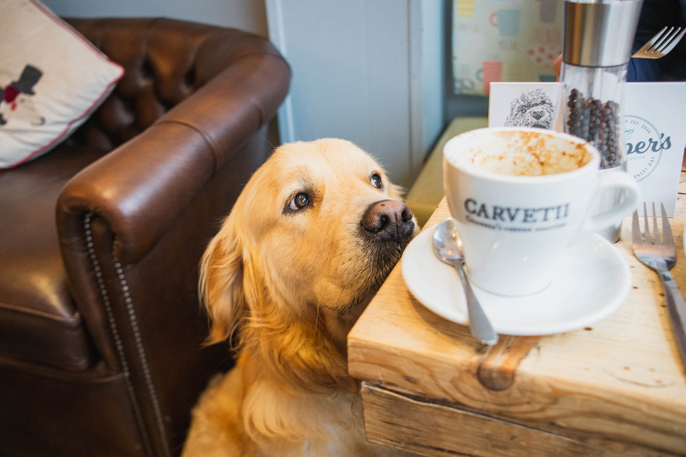

## Small, dog-friendly coffee shop & cafe located in the picturesque lakeland town of Keswick.  Marketed as the most dog friendly cafe in Keswick, it's a great spot to grab a breakfast & a coffee with your four-legged companion.

```grid|1

```

```grid|2


```

Keswick is sure to be one of the most dog-friendly towns in the UK. As well as having surroundings that are equipped to provide an array of excellent dog walks, it also exhibits a great selection of cafes, restaurants, & bars that open their doors to dogs.  Making Keswick a great place to stop off to refuel for a day in the fells.  

Jasper's, a small cafe on Station street, prides itself on it friendliness to dogs.  The walls are adorned with canine related images and decorations, the menu items are named after dogs, and the staff are very welcoming towards dogs.  A great place to get a coffee or a bite to eat.  They serve coffee from local Lake District roaster, Carvetti, as well as a great selection of breakfast and lunch items.