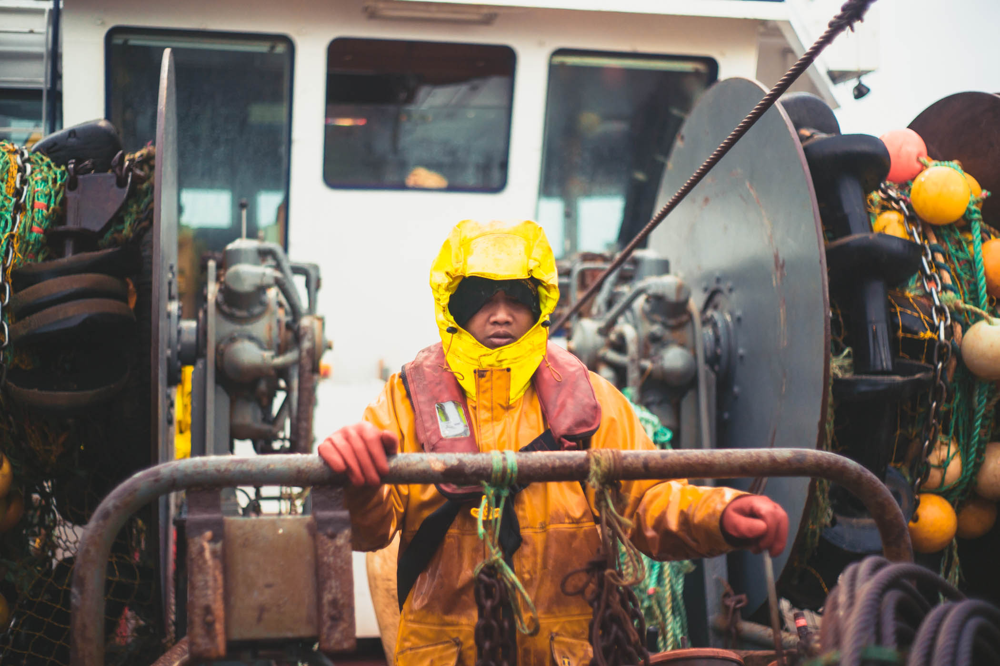
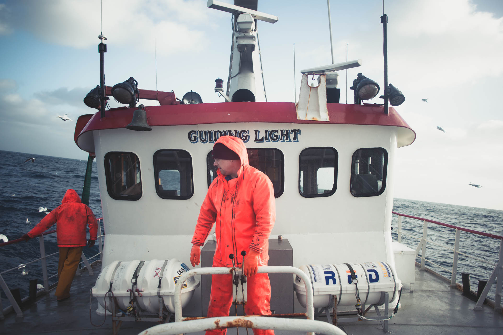

## The waters surrounding Shetland have been fished by many for centuries, providing a source of food and income.  The Shetland seafood industry is worth around £300 million annually, far more than any other industry in the isles.


```grid|1

```

Many fishermen spend a huge part of their lives at sea, often battling the elements to get their catch. Sea conditions can be extreme around Shetland as winds often gust over 100mph and wave heights have been known to reach over 15m high.

This series of images is the outcome of a succession of trips aboard local white fishing vessels in the waters around Shetland.

```grid|2


```

```grid|1

```

```grid|2


```

```grid|2


```

```grid|2


```

```grid|2



```

```grid|1

```

```grid|2


```

```grid|1

```

```grid|2


```
